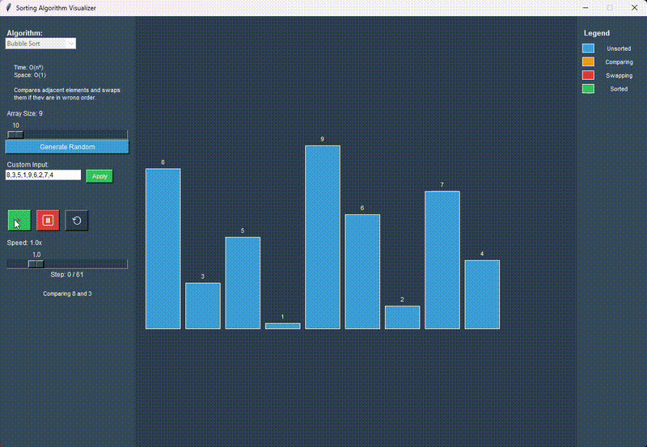
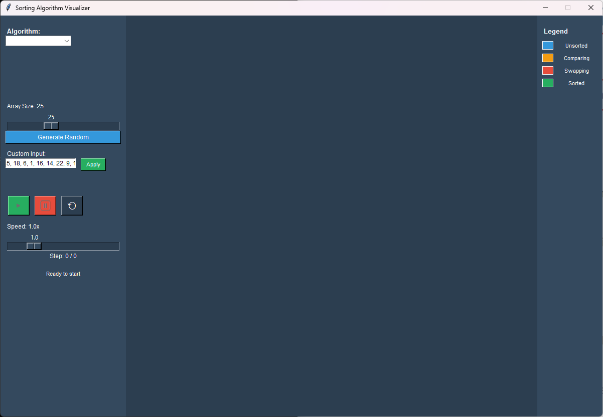
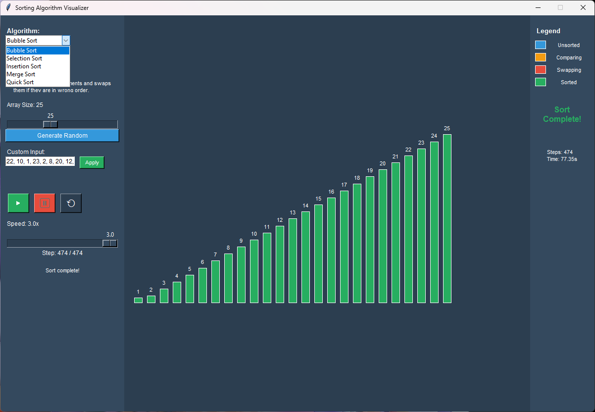
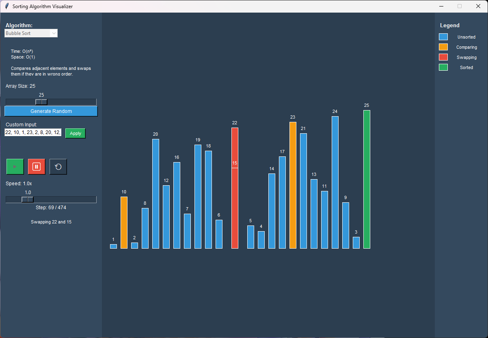
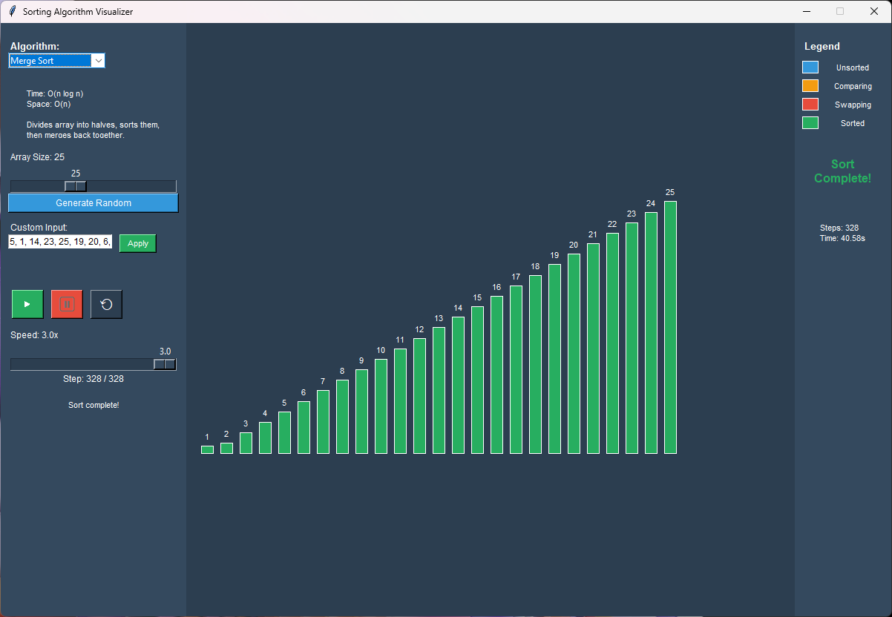

# 🚀 Algorithm Visualizer

[](https://github.com/Rblea97/Algorithm-Visualizer/actions)
[](https://www.python.org/downloads/)
[](https://opensource.org/licenses/MIT)
[](https://github.com/Rblea97/Algorithm-Visualizer)
[](https://github.com/Rblea97/Algorithm-Visualizer)

> **Interactive desktop application for visualizing sorting algorithms with smooth animations and educational features**

A sorting algorithm visualizer built with Python and tkinter, featuring smooth animations, real-time controls, and educational content. Designed with clean architecture and good software engineering practices.

## ⚡ Quick Demo



*Quick demo showing bubble sort visualization with real-time controls and smooth animations*

## 🎬 Live Demo

### Main Interface

*Clean three-panel design with intuitive controls and real-time visualization*

### Interactive Features Demo

**[📹 Interactive Features Demo](screenshots/interactive_features.mp4)** *(Download to view)* - Interactive controls, algorithm selection, and real-time speed adjustment

### Algorithm Demos
- **[📹 Bubble Sort Demo](screenshots/bubble_sort_demo.mp4)** *(Download to view)* - Basic sorting visualization
- **[📹 Algorithm Comparison](screenshots/algorithm_comparison.mp4)** *(Download to view)* - Performance comparison between algorithms

---

## 📋 Table of Contents
- [🎯 Key Features](#-key-features)
- [🏗️ Technical Highlights](#️-technical-highlights)  
- [🚀 Quick Start](#-quick-start)
- [📊 Supported Algorithms](#-supported-algorithms)
- [🎮 User Interface](#-user-interface)
- [⚙️ Installation](#️-installation)
- [🧪 Testing](#-testing)
- [🏛️ Architecture](#️-architecture)
- [🔧 Development](#-development)
- [📈 Performance](#-performance)
- [🤝 Contributing](#-contributing)

---

## 🎯 Key Features

### 🎨 **Clean UI/UX Design**
- **Three-panel layout** with intuitive interface
- **Real-time controls**: Play, pause, reset, and speed adjustment (0.5x-3.0x)
- **Color-coded visualization** with clear visual design
- **Responsive design** optimized for educational use

### ⚡ **Smooth Animation System**
- **Smooth animations** with frame interpolation
- **Responsive execution** using tkinter's after() scheduling
- **Optimized for educational use** - handles arrays up to 50 elements
- **Real-time speed control** without animation restart

### 🎓 **Educational Excellence**
- **5 sorting algorithms** with step-by-step visualization
- **Algorithm complexity information** (time/space)
- **Progress tracking** with operation descriptions
- **Flexible input options**: random generation or custom arrays

### 🛡️ **Robust Engineering & Quality**
- **Input validation** with sanitization and range checking
- **Protection against malformed input** (prevents application crashes)
- **Type hints throughout** for maintainability and IDE support
- **Modular architecture** following SOLID principles
- **Cross-platform compatibility** (Windows optimized)

---

## 🏗️ Technical Highlights

### **Software Architecture & Design Patterns**
- **Model-View-Controller (MVC)** pattern for clean separation of concerns
- **Abstract Base Classes** for algorithm implementations ensuring consistency
- **Observer Pattern** for UI component communication
- **Factory Pattern** for algorithm instantiation

### **Performance & Optimization**
- **Smooth animation system** using `tkinter.after()` for consistent performance
- **Memory management** with proper resource cleanup
- **Optimized data structures** for real-time visualization
- **Scalable design** supporting future algorithm additions

### **Code Quality & Standards**
- **Type hints** and comprehensive docstrings
- **Error handling** with graceful degradation
- **Input validation** with detailed user feedback
- **Consistent coding standards** throughout codebase

### **Good Development Practices**
- **Modular package structure** with clear dependencies
- **Comprehensive documentation** for users and developers
- **Version control ready** with proper .gitignore and project files
- **Distribution ready** with setup.py and requirements-dev.txt

---

## 🚀 Quick Start

### **Run from Source**
```bash
# Clone the repository
git clone https://github.com/Rblea97/Algorithm-Visualizer.git
cd Algorithm-Visualizer

# Run the application (no installation required!)
python main.py
```

**That's it!** The application uses only Python standard library modules.

### **First Steps:**
1. 🔽 Select an algorithm from the dropdown
2. 🎲 Click "Generate Random" for sample data  
3. ▶️ Press Play to start the visualization
4. 🎛️ Adjust speed in real-time with the slider

### **System Requirements**
- **Python 3.8 or higher**
- **tkinter** (included with Python)
- **Operating System**: Windows, macOS, or Linux
- **No external dependencies** - uses Python standard library only

---

## 📊 Supported Algorithms

| Algorithm | Time Complexity | Space Complexity | Best Use Case | Visual Highlights |
|-----------|----------------|------------------|---------------|-------------------|
| **Bubble Sort** | O(n²) | O(1) | Educational demo | Adjacent comparisons, "bubbling" effect |
| **Selection Sort** | O(n²) | O(1) | Memory-constrained | Minimum finding, predictable passes |
| **Insertion Sort** | O(n²) | O(1) | Small/sorted data | Card-sorting simulation |
| **Merge Sort** | O(n log n) | O(n) | Large datasets | Divide-and-conquer visualization |
| **Quick Sort** | O(n log n) | O(log n) | General purpose | Pivot partitioning dynamics |

---

## 🎮 User Interface

### **Visual Demonstrations**

| Algorithm Selection | Animation in Progress | Completion State |
|----|----|----| 
|  |  |  |
| *Dropdown shows all 5 algorithms* | *Real-time visualization with color coding* | *Success indicators and statistics* |

### **Algorithm Comparison Demo**

**[📹 Algorithm Comparison Demo](screenshots/algorithm_comparison.mp4)** *(Download to view)* - Performance comparison: Bubble Sort vs Quick Sort on worst-case input

### **Three-Panel Design**
```
┌─────────────┬──────────────────────┬─────────────┐
│   Control   │    Visualization     │   Legend    │
│    Panel    │       Canvas         │   & Info    │
│             │                      │             │
│ • Algorithm │  ████ ████ ████     │ • Colors    │
│   Selection │  ████ ████ ████     │ • Progress  │
│ • Array     │  ████ ████ ████     │ • Stats     │
│   Controls  │                      │             │
│ • Playback  │                      │             │
│ • Speed     │                      │             │
└─────────────┴──────────────────────┴─────────────┘
```

### **Color Coding System**
- 🔵 **Blue**: Unsorted elements
- 🟠 **Orange**: Elements being compared  
- 🔴 **Red**: Elements being swapped
- 🟢 **Green**: Sorted elements (final position)

### **Interactive Controls**
- **▶️ Play/Pause**: Start or pause animation with resume capability
- **⟲ Reset**: Return to initial unsorted state
- **🎛️ Speed Control**: Real-time adjustment (0.5x to 3.0x)
- **📊 Array Controls**: Random generation (10-50 elements) or custom input

---

## ⚙️ Installation

### **System Requirements**
- **Python 3.8 or higher**
- **tkinter** (included with Python)
- **Operating System**: Windows (optimized), macOS, Linux (compatible)

### **Standard Installation**
```bash
# Clone repository
git clone https://github.com/Rblea97/Algorithm-Visualizer.git
cd Algorithm-Visualizer

# Optional: Create virtual environment
python -m venv venv
source venv/bin/activate  # On Windows: venv\\Scripts\\activate

# Run application
python main.py
```

### **Development Installation**
```bash
# Install development dependencies (optional - for testing/linting only)
pip install -r requirements-dev.txt

# Run tests
python -m pytest

# Format code
black .

# Type checking
mypy .

# Linting
ruff check .
```

### **Binary Assets Notice**
⚠️ **Repository Size Optimization**: The `screenshots/` directory contains video files (`.mp4`) and animated GIFs that increase repository size. For production use, consider:
- Using Git LFS for media files
- Hosting large assets externally (GitHub Releases, CDN)
- Converting to smaller formats or static images

Current media files:
- `demo.gif`, `bubble_sort_demo.mp4`, `algorithm_comparison.mp4`, `interactive_features.mp4`

---

## 🧪 Testing

The application includes a comprehensive test suite:

```bash
# Run all tests
python -m pytest tests/ -v

# Run specific test modules
python -m pytest tests/test_sorting_algorithms.py -v      # Algorithm correctness tests
python -m pytest tests/test_input_validator.py -v         # Input validation tests  
python -m pytest tests/test_animation_controller.py -v    # Animation system tests
python -m pytest tests/test_ui_integration.py -v          # UI integration tests

# Basic functionality test
python main.py

# Algorithm correctness verification
python -c "from algorithms import ALGORITHMS; print('All algorithms loaded successfully')"
```

**Test Coverage Includes:**
- ✅ **Algorithm correctness**: All sorting algorithms tested for correctness, edge cases, and step generation
- ✅ **Input validation**: Security testing including malicious input handling, buffer overflow attempts, and edge cases
- ✅ **Animation system**: State management, timing control, callback functionality, and resource cleanup
- ✅ **UI integration**: Component interaction, callback system, and error handling
- ✅ **Security validation**: Protection against injection attempts, malformed input, and invalid data

### **Input Validation Testing**
```bash
# Run comprehensive input validation tests
python -m pytest tests/test_input_validator.py -v

# Test malformed input handling
python -c "
from utils.input_validator import InputValidator
test_inputs = ['abc,def,ghi', '101,102,103', '1,' * 100, '<script>alert(1)</script>']
for inp in test_inputs:
    valid, _, error = InputValidator.validate_input(inp)
    print(f'Input: {inp[:20]}... Rejected: {not valid}')
"
```

**Input Validation Features:**
- ✅ **Format Validation**: Accepts only valid integer input with commas
- 🔢 **Range Validation**: Numbers must be within 1-100 range  
- 📏 **Size Limits**: Maximum 50 elements to ensure good performance
- 🚫 **Character Filtering**: Rejects non-numeric characters and malformed input
- ⚠️ **Error Handling**: Clear error messages for invalid input

---

## 🏛️ Architecture

### **Project Structure**
```
Algorithm_visualizer/
├── 📄 main.py                 # Application entry point & orchestration
├── 📁 algorithms/             # Sorting algorithm implementations
│   ├── 🔧 base_algorithm.py   # Abstract base class
│   ├── 🫧 bubble_sort.py      # O(n²) comparison-based
│   ├── 🔍 selection_sort.py   # O(n²) selection-based  
│   ├── 📥 insertion_sort.py   # O(n²) insertion-based
│   ├── 🔀 merge_sort.py       # O(n log n) divide-and-conquer
│   └── ⚡ quick_sort.py       # O(n log n) partition-based
├── 📁 ui/                     # User interface components
│   ├── 🎛️ control_panel.py    # Left panel: controls & settings
│   ├── 🎨 visualization_canvas.py # Center: animation display
│   └── 📊 legend_panel.py     # Right panel: info & legend
├── 📁 utils/                  # Utility modules & helpers
│   ├── ⚙️ constants.py        # Application constants & config
│   ├── 🎬 animation_controller.py # Animation timing & control
│   └── ✅ input_validator.py   # Input validation & sanitization
├── 📁 tests/                  # Comprehensive test suite
│   ├── 🧪 test_sorting_algorithms.py    # Algorithm correctness tests
│   ├── 🔒 test_input_validator.py       # Security & validation tests
│   ├── ⚡ test_animation_controller.py  # Animation system tests
│   └── 🖥️ test_ui_integration.py       # UI integration tests
├── 📄 requirements-dev.txt    # Development dependencies
├── 📄 setup.py               # Package configuration
├── 📄 .gitignore             # Version control exclusions
└── 📚 Documentation/          # Comprehensive guides
```

### **Design Patterns Used**
- **🏗️ MVC Architecture**: Clean separation between model, view, and controller
- **🏭 Abstract Factory**: Algorithm creation and management
- **👀 Observer Pattern**: UI component communication and updates
- **🎭 Strategy Pattern**: Pluggable algorithm implementations
- **🔧 Command Pattern**: Animation control operations

### **Key Architectural Decisions**
1. **Separation of Concerns**: Each module has a single, well-defined responsibility
2. **Extensibility**: Easy to add new algorithms or UI components
3. **Performance**: Non-blocking animations with efficient rendering
4. **Maintainability**: Type hints, documentation, and consistent patterns

---

## 🔧 Development

### **Adding New Algorithms**
```python
# 1. Create new algorithm class inheriting from SortingAlgorithm
class YourSort(SortingAlgorithm):
    def get_steps(self, arr): 
        # Return list of (action, indices, description) tuples
        pass
    
    def get_complexity(self): 
        return ("O(?)", "O(?)")
    
    def get_description(self): 
        return "Your algorithm description"
    
    def get_name(self): 
        return "Your Sort"

# 2. Register in algorithms/__init__.py
ALGORITHMS['Your Sort'] = YourSort
```

### **Customizing UI**
- **Colors**: Modify `utils/constants.py` COLORS dictionary
- **Layout**: Adjust panel dimensions in constants
- **Features**: Extend UI classes with new components

### **Performance Tuning**
- **Animation Speed**: Adjust `FRAME_INTERVAL_MS` and `INTERPOLATION_FRAMES`
- **Array Limits**: Modify `ARRAY_SIZE_MAX` for larger datasets
- **Memory Usage**: Implement step caching for complex algorithms

---

## 📈 Performance

### **Performance Characteristics**
- **Smooth Animation**: Consistent frame rate for educational datasets (10-50 elements)
- **Memory Efficient**: Low RAM usage during typical operation  
- **Responsive UI**: Fast response to user interactions
- **Quick Startup**: Fast launch time from main.py

### **Scalability Considerations**
- **Array Size**: Optimized for educational use (10-50 elements)
- **Algorithm Complexity**: Handles O(n²) algorithms smoothly
- **UI Responsiveness**: Non-blocking operations maintain smooth experience
- **Resource Management**: Proper cleanup prevents memory leaks

---

## 🤝 Contributing

This project demonstrates professional software development practices and is designed for educational use. While primarily a portfolio piece, contributions that enhance its educational value are welcome.

### **Areas for Enhancement**
- 🎵 **Audio feedback** for operations
- 📊 **Performance benchmarking** features  
- 🔄 **Algorithm comparison** mode
- 📱 **Web-based version** using modern frameworks
- 🎯 **Interactive tutorials** and guided learning

### **Development Guidelines**
- Follow existing code style and architecture patterns
- Include comprehensive documentation for new features
- Ensure all new algorithms include educational descriptions
- Maintain performance standards for smooth animations

---

## 📋 Technical Skills Demonstrated

### **🐍 Python Proficiency**
- Advanced OOP with inheritance and polymorphism
- Type hints and modern Python practices (3.8+)
- Standard library mastery (tkinter, typing, abc)
- Performance optimization and memory management

### **🎨 UI/UX Development**  
- Custom tkinter application with professional design
- Real-time animation and interactive controls
- User experience optimization for educational contexts
- Responsive layout design with fixed and flexible panels

### **🏗️ Software Architecture**
- Clean Architecture and SOLID principles
- Design patterns (MVC, Factory, Observer, Strategy)
- Modular design with clear separation of concerns
- Extensible architecture supporting future enhancements

### **⚡ Performance Engineering**
- Smooth animation system optimization
- Non-blocking UI with proper threading concepts
- Memory-efficient data structure usage
- Real-time user interaction handling

### **📚 Educational Technology**
- Algorithm visualization and educational content design
- Step-by-step learning progression
- Complex concept simplification and presentation
- Interactive learning tool development

---

## 📜 License

This project is licensed under the MIT License - see the [LICENSE](LICENSE) file for details.

---

## 🎓 Educational Use

Perfect for:
- **Computer Science Students**: Understanding sorting algorithm mechanics
- **Educators**: Teaching algorithm analysis and complexity concepts
- **Interview Preparation**: Visualizing common coding interview topics
- **Self-Learning**: Interactive exploration of fundamental algorithms

---

## 👨‍💻 About This Project

**Development Timeline**: Developed as a comprehensive sorting algorithm educational tool, demonstrating professional software development practices and technical proficiency in Python GUI development.

This Algorithm Visualizer demonstrates:
- **Clean Python development** with maintainable code
- **UI/UX design principles** applied to educational software
- **Software engineering best practices** including architecture, documentation, and testing
- **Educational technology development** with focus on user experience and learning outcomes

Built as a portfolio project showcasing technical skills, software design capabilities, and commitment to code quality and user experience.

---

<div align="center">

**⭐ Star this repository if you found it helpful!**

[🐛 Report Bug](https://github.com/Rblea97/Algorithm-Visualizer/issues) • [✨ Request Feature](https://github.com/Rblea97/Algorithm-Visualizer/issues) • [📚 Documentation](https://github.com/Rblea97/Algorithm-Visualizer/wiki)

</div>
